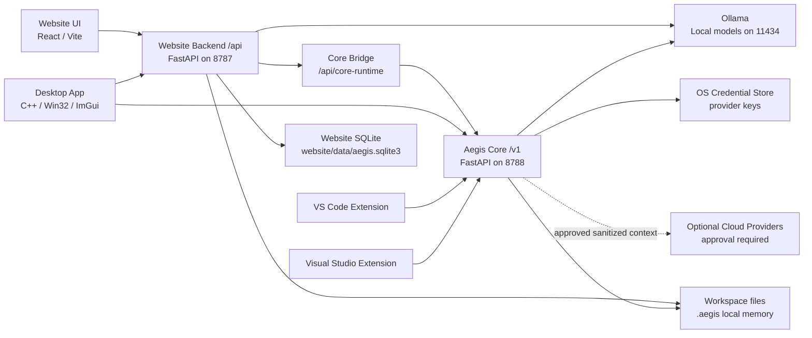

# Aegis ChatBot / Auralith OS System Architecture

Last updated: 2026-05-09

## Purpose

This repository contains the Aegis ChatBot / Auralith OS local-first AI ecosystem. It is not one chatbot process. It is a set of clients and runtimes that share workspace intelligence, local model status, memory, diagnostics, validation, tasks, and safe change workflows.

The current stabilization target is to keep the mature Website backend stable while making Aegis Core the small shared runtime that every client can rely on.

## Runtime Layers

## Layer Ownership

### Website Backend `/api`

The Website backend is the mature application runtime. It owns app-rich workflows that are still specific to Auralith OS and the Desktop client:

- Chat, streaming chat, routing preview, generated changes, apply, validate, verify, checkpoint restore.
- Project builder/scaffolding.
- Model registry, model manager, model benchmarks, provider routing, telemetry, feedback.
- Project intelligence, workspace intelligence, unified runtime/context, continuity, platform discipline.
- Distributed runtime, adaptive intelligence, productization, ecosystem, autonomous engineering.
- Creative Studio and media jobs.
- Website auth/session APIs.
- SQLite-backed application event/task/telemetry storage.
- Optional Core adapter at `/api/core-runtime` plus low-risk adapter reads for `/api/health`, `/api/ready`, `/api/models`, and `/api/config`.

Default port: `http://127.0.0.1:8787`.

### Aegis Core `/v1`

Aegis Core is the shared local runtime contract. It must stay small, stable, local-first, and safe for Desktop, Website, VS Code, and Visual Studio to call:

- Core health and local model status.
- Local-first hybrid model routing, provider inventory, and gated completion contracts.
- Shared settings stored in workspace-local `.aegis/config.json`.
- Workspace scan and roadmap generation.
- Shared memory summaries and diagnostics.
- Client registration and client listing.
- Shared tasks, task status, and dashboard aggregation.
- Supervised autonomous task orchestration: goal planning, local queue state, specialized owner agents, approval gates, validation state, and memory updates.
- Validation summary/run.
- Plan-only continue and repair flows.
- Branding tokens shared by clients.

Hybrid routing is privacy-first:

- Default mode is `local_only`.
- Normal chat, code completion, code review, roadmap generation, and smaller fixes stay local on Ollama unless clients explicitly request a route plan that considers cloud.
- Cloud providers require visible warnings, user approval, sanitized context metadata, and API keys in OS credential storage.
- Core rejects secret-like, ignored, or outside-workspace files from cloud context.

Autonomous orchestration is supervised by design:

- Core may create and advance a staged queue, but it does not blindly edit files.
- Planner, Architect, Coder, Reviewer, Tester, Repair, and Documentation agents are local roles sharing `.aegis` memory.
- File edits, deletion, package installs, build/test/lint commands, and cloud context all require explicit approval gates.
- Clients own the approval UI, diff display, patch application, and rollback execution.
- Core records progress in `.aegis/orchestration-queue.json`, `.aegis/active-orchestration.json`, `roadmap.md`, `decisions.md`, `validation-log.md`, and `agent-history.json`.

Core `/v1` responses use the shared envelope from `aegis-core/aegis_core/contracts.py`:

- `api_version: v1`
- `contract_version: 2026.05.09`
- `kind`
- `workspace`
- `data`
- `stability`
- `deprecated`
- `deprecations`

Default port: `http://127.0.0.1:8788`.

### Desktop Client

The Desktop app is a native shell and command center. It should own UI state, local preferences, windowing, streaming display, and user approval surfaces. It should not reimplement shared scan, dashboard, model health, or task semantics that exist in Core.

Current integrations:

- Uses Website `/api` for the mature app workflows.
- Uses Core `/v1/clients/register` and `/v1/ecosystem/dashboard`.
- Degrades when Core is offline by continuing to use Website `/api`.

### VS Code Extension

The VS Code extension owns IDE-specific UX, VS Code command registration, current editor/selection context, proposal preview, apply, rollback, and extension storage.

Current Core integrations:

- `/v1/health`
- `/v1/models`
- `/v1/settings`
- `/v1/workspaces/scan`
- `/v1/workspaces/roadmap`
- `/v1/memory`
- `/v1/diagnostics`
- `/v1/validation`
- `/v1/clients/register`
- `/v1/tasks`
- `/v1/tasks/{task_id}/status`
- `/v1/orchestration`
- `/v1/orchestration/plan`
- `/v1/orchestration/step`

### Visual Studio Extension

The Visual Studio extension owns Visual Studio-specific UX, solution/project detection, selected-code context, Error List/build output integration, proposal approval, and rollback.

Current Core integrations:

- `/v1/health`
- `/v1/clients/register`

## Dependency Direction

The desired direction is:

- Clients may call Website `/api` for rich app workflows.
- Clients may call Core `/v1` for shared runtime state.
- Core must not depend on Website backend internals.
- Website may call Core through a thin bridge, but it must not require Core to be running for the mature web app to function.
- IDE extensions should prefer Core `/v1` for shared health, memory, tasks, diagnostics, roadmap, validation, and dashboard data as those integrations mature.

## Stabilization Rule

Do not move large workflows from Website `/api` into Core during stabilization. First make the boundary explicit, test it, and migrate one shared capability at a time only when all clients have a clear consumer contract.

## Runtime Consolidation Phase 1

Phase 1 adds a read-only Website-to-Core bridge instead of migrating workflows:

- `GET /api/core-runtime` reads Core `/v1/health`, `/v1/models`, `/v1/settings`, `/v1/memory`, `/v1/diagnostics`, and `/v1/ecosystem/dashboard`.
- `AEGIS_CORE_API_URL` controls the Core base URL for Website.
- Existing Website `/api` chat, apply, validation, routing, project-builder, auth, and product surfaces remain unchanged.
- Core stays independent of Website imports and Website-specific storage.

See `RUNTIME_CONSOLIDATION.md` for the subsystem ownership matrix and migration order.

## Website Runtime Adapter Phase

The Website backend has started consuming Core through adapters while keeping frontend `/api` calls stable:

- `GET /api/health` and `GET /api/ready` report Core adapter status and degrade cleanly when Core is offline.
- `GET /api/models` overlays Core model inventory with Website provider inventory.
- `GET /api/config` reports Core settings adapter status.
- `POST /api/config` saves Website `.env` first, then best-effort syncs shared model settings to Core `/v1/settings`.
- `GET /api/core-runtime` remains the full Core envelope bridge for health, models, settings, memory, diagnostics, and dashboard.

The Website still owns chat, streaming, generated changes, apply, checkpoint restore, validation/repair orchestration, project builder, auth/session, Creative Studio, and advanced product workflows.

## Unified Contract Phase

The current contract stabilization pass keeps every existing client URL intact and adds a shared schema layer:

- `aegis_core.contracts` defines Core request bodies, envelopes, stable runtime response shapes, and experimental schema-only patch/rollback shapes.
- Core `/v1` endpoints now advertise a contract version and stability state while preserving `ok`, `api_version`, `kind`, `workspace`, and `data`.
- Website bridge helpers adapt Core dashboard, task, and validation data into Website-friendly summaries for future `/api` shims.
- `CLIENT_COMPATIBILITY_MATRIX.md` tracks which clients call which Core endpoints and whether each contract is stable, experimental, or schema-only.

The next consolidation candidates are low-risk read or record-oriented flows: Website model status reads, Website task mirroring, IDE roadmap reads, and IDE validation reads. Chat, file apply, checkpoint restore, project builder, auth, Creative Studio, and advanced product workflows remain Website-owned.

## Post-Migration Cleanup Rule

Duplicate logic is now tracked in `DEPRECATION_PLAN.md`. Removal is allowed only when:

- the replacement Core contract is stable and tested;
- every active client has a compatible parser/fallback path;
- Website and frontend compatibility tests cover the old `/api` shape;
- Core-offline behavior remains clear and non-crashing;
- rollback/apply safety tests exist for any file-writing workflow.

## Release Candidate Validation

The current daily dogfooding release candidate keeps the established runtime split:

- Core owns shared `/v1` contracts for health, models, hybrid model routing, settings, workspace scan, roadmap, memory summary, diagnostics, clients, tasks, supervised orchestration, validation, and plan-only continue/repair.
- Website `/api` owns rich product workflows, chat, generated changes, apply, checkpoint restore, Website memory CRUD, task UX, auth/session, and advanced product surfaces.
- Desktop and Website can continue using `/api` when Core is offline.
- VS Code and Visual Studio keep local IDE-specific apply/rollback behavior while gradually reading shared state from Core.

The latest RC validation verified startup, smoke workflows, Core-offline degraded Website health, backend-offline frontend availability, invalid workspace errors, simulated Ollama failure, Website rollback after failed validation, VS Code VSIX install, Visual Studio VSIX packaging, and desktop GUI smoke captures. See `ECOSYSTEM_VALIDATION_REPORT.md`.
