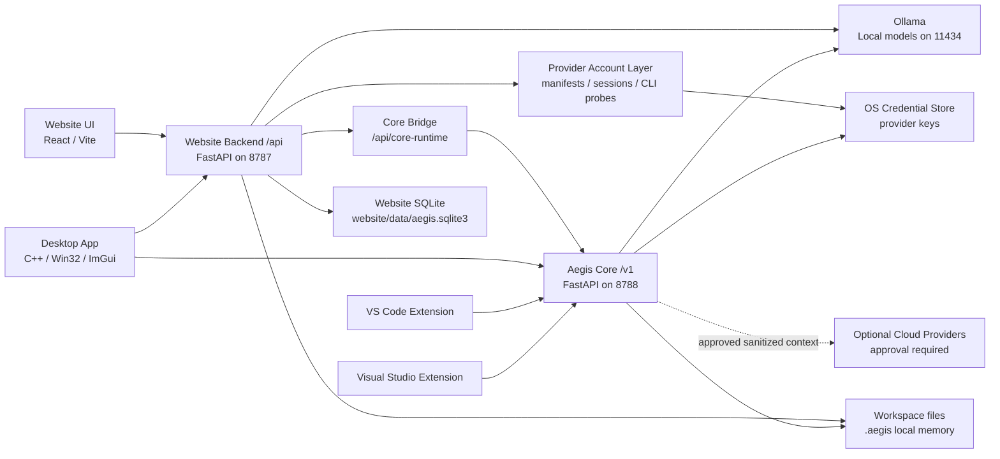

# Aegis ChatBot / Auralith OS System Architecture

Last updated: 2026-05-11

## Purpose

This repository contains the Aegis ChatBot / Auralith OS local-first AI ecosystem. It is not one chatbot process. It is a set of clients and runtimes that share workspace intelligence, local model status, memory, diagnostics, validation, tasks, and safe change workflows.

The current stabilization target is to keep the mature Website backend stable while making Aegis Core the shared runtime authority that every client can rely on.

## Runtime Layers

## Layer Ownership

### Website Backend `/api`

The Website backend is the mature product gateway. It owns app-rich workflows that are still specific to Auralith OS and the Desktop client, and it preserves the stable `/api` shape consumed by the Website frontend and native clients:

- Chat, streaming chat, routing preview, generated change display, verify, and compatibility wrappers for apply, validate, checkpoints, and restore.
- Core-delegated runtime workflows for generated-change apply, checkpoint create/list/restore, validation run storage, and repair workflow creation when Core is available.
- Project builder/scaffolding.
- Model registry, model manager, model benchmarks, provider routing, telemetry, feedback.
- Provider account foundation: provider manifests, secure API-key references, account/session metadata, and safe official-CLI bridge probing for account-based integrations.
- Project intelligence, workspace intelligence, unified runtime/context, continuity, platform discipline.
- Distributed runtime, adaptive intelligence, productization, ecosystem, autonomous engineering.
- Creative Studio and media jobs.
- Website auth/session APIs.
- SQLite-backed application event/task/telemetry storage.
- Optional Core adapters at `/api/core-runtime` and `/api/runtime/delegation` plus adapter reads for `/api/health`, `/api/ready`, `/api/models`, and `/api/config`.

Default port: `http://127.0.0.1:8787`.

### Aegis Core `/v1`

Aegis Core is the shared local runtime contract. It must stay small, stable, local-first, and safe for Desktop, Website, VS Code, and Visual Studio to call:

- Core health and local model status.
- Local-first hybrid model routing, provider inventory, and gated completion contracts.
- Shared settings stored in workspace-local `.aegis/config.json`.
- Workspace scan and roadmap generation.
- Shared memory summaries and diagnostics.
- Client registration and client listing.
- Shared tasks, task status, and dashboard aggregation.
- Core-owned editing runtime: proposed changes, patch previews, apply selected/all, pre-apply checkpoints, rollback/restore, validation result storage, operation jobs, and project activity.
- Unified orchestration runtime: workflow graphs, task dependencies, pause/resume/cancel/retry, client sync, event streaming, agent-role execution records, safety controls, and observability.
- Supervised autonomous task orchestration: goal planning, local queue state, specialized owner agents, approval gates, validation state, and memory updates.
- Safe scheduled and trigger-based maintenance jobs for proactive scans, summaries, reports, roadmap refreshes, TODO review, documentation drift, and validation status.
- Project quality intelligence: health scoring, trend snapshots, risk detection, daily/weekly quality reports, and Planner Agent guidance.
- Knowledge graph and deep project understanding: semantic relationships between files, systems, APIs, UI components, services, tasks, roadmap items, decisions, bugs, validation failures, and history.
- Predictive planning and change simulation: read-only forecasts for impacted files, affected systems, build/test risk, dependency ripple, architecture drift, validation cost, rollback complexity, and scenario comparison.
- Autonomous engineering operations: release planning, technical debt tracking, lifecycle awareness, long-term risk monitoring, maintenance scheduling, productivity intelligence, and cross-project coordination.
- Adaptive personal engineering intelligence: local preference memory, workflow/style learning, recurring project pattern recognition, personalized recommendations, habit analysis, and resettable user-controlled profile state.
- Validation summary/run.
- Plan-only continue and repair flows.
- Branding tokens shared by clients.

Hybrid routing is privacy-first:

- Default mode is `local_only`.
- Normal chat, code completion, code review, roadmap generation, and smaller fixes stay local on Ollama unless clients explicitly request a route plan that considers cloud.
- Cloud providers require visible warnings, user approval, sanitized context metadata, and API keys in OS credential storage.
- Core rejects secret-like, ignored, or outside-workspace files from cloud context.

### Provider Account Layer

The provider-account layer is Website-owned in this foundation slice and is designed to feed the shared router later. It lives under `website/backend/aegis_ai/providers/accounts/` and owns:

- Provider manifests for OpenAI, Anthropic, Google Gemini, Ollama, OpenRouter, Azure OpenAI, Bedrock, and Vertex AI.
- API-key linking through the OS credential vault; SQLite stores only credential references, hints, status, scopes, and session metadata.
- CLI bridge detection for official local CLIs. Aegis runs short allowlisted version/status probes and does not import token files.
- Future OAuth/device-code slots that require Aegis-owned provider app registrations before becoming active.

Current supported mutations are provider API-key link/unlink and safe CLI probing. OAuth, direct CLI work delegation, and enterprise profile execution remain planned follow-up phases.

Autonomous orchestration is supervised by design:

- Core may create and advance a staged queue, but it does not blindly edit files.
- Planner, Architect, Coder, Reviewer, Tester, Repair, and Documentation agents are local roles sharing `.aegis` memory.
- File edits, deletion, package installs, build/test/lint commands, and cloud context all require explicit approval gates.
- Clients own approval UI and diff display. Core owns the shared apply/checkpoint/rollback contract; Website currently acts as the compatibility gateway for clients still using `/api`.
- Core records progress in `.aegis/orchestration-queue.json`, `.aegis/active-orchestration.json`, `roadmap.md`, `decisions.md`, `validation-log.md`, and `agent-history.json`.

Workflow automation is safe by default:

- Core exposes job state through `/v1/jobs` and job execution through `/v1/jobs/run`.
- Jobs may scan, summarize, report, recommend, and write generated `.aegis` memory/log files.
- Jobs do not edit project source, delete files, install packages, run build/test/lint commands, or send cloud context without explicit approval.
- Job state is stored in `.aegis/jobs-state.json`; job history is appended to `.aegis/jobs-log.md`.

Quality intelligence is observability for local projects:

- Core exposes the current health dashboard through `/v1/quality` and records history through `/v1/quality/snapshot`.
- Snapshots are stored in `.aegis/health-history.json`.
- Generated reports are written to `.aegis/daily-health-report.md` and `.aegis/weekly-quality-summary.md`.
- The dashboard combines validation status, dependency drift, TODOs, known bugs, stale docs, complexity hotspots, repeated repairs, model failures, risky diffs, and frequently changed files.
- Planner Agent reads this data while creating orchestration plans so broken builds, repeated failures, high-risk files, and missing tests can be prioritized before speculative work.

Knowledge graph intelligence is relationship context for local projects:

- Core exposes the graph through `/v1/knowledge/graph` and deterministic relationship queries through `/v1/knowledge/query`.
- Persisted graph state lives in `.aegis/knowledge-graph.json`; generated summaries live in `.aegis/knowledge-summary.md`.
- Relationship types include `uses`, `depends_on`, `calls`, `implements`, `breaks`, `related_to`, `tested_by`, and `mentioned_in_roadmap`.
- Graph data is safe for future Desktop visualization because the response includes clusters, hotspots, unstable modules, and a visualization-friendly subset.
- Planner Agent reads graph summaries so impacted systems, related decisions/issues, and suggested context files can guide safer plans.

Predictive simulation is the planning guardrail before edits:

- Core exposes `/v1/simulation/change` for one planned change and `/v1/simulation/compare` for implementation approach comparison.
- Forecasts combine scan data, graph relationships, quality trends, validation logs, dependency ripple, unstable modules, and requested context files.
- The response is UI-ready: predicted impact, confidence score, affected systems, validation cost, rollback complexity, build/test risks, and architecture drift warnings.
- Planner Agent consumes the simulation summary while creating orchestration plans and inserts a dedicated risk-splitting task when a forecast is high risk.
- Simulation is advisory and read-only; clients still own approval, diffs, patch application, validation execution, and rollback.

Autonomous engineering operations is the long-term coordination layer:

- Core exposes `/v1/operations` for a single project and `/v1/operations/dashboard` when clients want to include additional local project roots.
- Operations reads existing Core intelligence: quality trends, knowledge graph, shared tasks, maintenance jobs, validation status, roadmap state, technical debt signals, and project history.
- The dashboard returns release readiness, release milestones, implementation phases, validation checkpoints, debt signals, cleanup/refactor/stability priorities, lifecycle stage, risk monitoring, maintenance schedules, productivity bottlenecks, and suggested next actions.
- Cross-project awareness is advisory: shared libraries, shared tooling, repeated architecture patterns, and unavailable project roots are surfaced so humans can coordinate updates safely.
- Operations does not make release decisions or execute risky work. It may recommend; humans approve edits, commands, package updates, cloud calls, and major project decisions.

Adaptive personal engineering intelligence is the local alignment layer:

- Core exposes `/v1/personal-intelligence` for read-only local analysis, `/v1/personal-intelligence/profile` for optional profile persistence, and `/v1/personal-intelligence/reset` for clearing local profile memory.
- Profile state lives in `.aegis/personal-engineering-profile.json` only when explicitly persisted or when explicit preferences are supplied.
- The service learns from local project structure, frameworks, naming conventions, architecture patterns, validation workflows, task ordering, coding style, recurring systems, quality signals, and open work.
- It adapts roadmap guidance, diff explanation style, planning depth, summary format, validation detail, and agent guidance while preserving safety gates.
- It does not store source contents, credentials, API keys, tokens, secrets, or provider credentials. Secret-like preference keys are filtered before persistence.

Core `/v1` responses use the shared envelope from `aegis-core/aegis_core/contracts.py`:

- `api_version: v1`
- `contract_version: 2026.05.09`
- `kind`
- `workspace`
- `data`
- `stability`
- `deprecated`
- `deprecations`

Default port: `http://127.0.0.1:8788`.

### Desktop Client

The Desktop app is a native shell and command center. It should own UI state, local preferences, windowing, streaming display, and user approval surfaces. It should not reimplement shared scan, dashboard, model health, or task semantics that exist in Core.

Current integrations:

- Uses Website `/api` for the mature app workflows.
- Uses Core `/v1/clients/register` and `/v1/ecosystem/dashboard`.
- Degrades when Core is offline by continuing to use Website `/api`.

### VS Code Extension

The VS Code extension owns IDE-specific UX, VS Code command registration, current editor/selection context, proposal preview, apply, rollback, and extension storage.

Current Core integrations:

- `/v1/health`
- `/v1/models`
- `/v1/settings`
- `/v1/workspaces/scan`
- `/v1/workspaces/roadmap`
- `/v1/memory`
- `/v1/diagnostics`
- `/v1/validation`
- `/v1/clients/register`
- `/v1/tasks`
- `/v1/tasks/{task_id}/status`
- `/v1/orchestration`
- `/v1/orchestration/plan`
- `/v1/orchestration/step`

### Visual Studio Extension

The Visual Studio extension owns Visual Studio-specific UX, solution/project detection, selected-code context, Error List/build output integration, proposal approval, and rollback.

Current Core integrations:

- `/v1/health`
- `/v1/clients/register`

## Dependency Direction

The desired direction is:

- Clients may call Website `/api` for rich app workflows.
- Clients may call Core `/v1` for shared runtime state.
- Core must not depend on Website backend internals.
- Website may call Core through a thin bridge, but it must not require Core to be running for the mature web app to function.
- IDE extensions should prefer Core `/v1` for shared health, memory, tasks, diagnostics, roadmap, validation, and dashboard data as those integrations mature.

## Stabilization Rule

Do not remove Website `/api` compatibility during migration. Move one shared capability at a time, keep fallback clear, and require Core contract tests plus Website compatibility tests before clients are asked to call Core directly.

## Runtime Consolidation Phase 1

Phase 1 added a read-only Website-to-Core bridge:

- `GET /api/core-runtime` reads Core `/v1/health`, `/v1/models`, `/v1/settings`, `/v1/memory`, `/v1/diagnostics`, and `/v1/ecosystem/dashboard`.
- `AEGIS_CORE_API_URL` controls the Core base URL for Website.
- Existing Website `/api` chat, routing, project-builder, auth, and product surfaces remain unchanged.
- Core stays independent of Website imports and Website-specific storage.

See `RUNTIME_CONSOLIDATION.md` for the subsystem ownership matrix and migration order.

## Runtime Delegation Phase

Phase 2 starts migrating workflow ownership behind stable Website routes:

- `POST /api/apply` delegates to Core `POST /v1/changes/apply`.
- `GET/POST /api/checkpoints` delegates to Core checkpoint list/create contracts.
- `POST /api/restore-checkpoint` delegates to Core checkpoint restore.
- `POST /api/validate` delegates to Core validation execution and validation result storage.
- Failed delegated validation queues a Core `repair_project` workflow through `POST /v1/workflows`.
- `GET /api/runtime/delegation` reports Core connected/disconnected, delegated workflow enablement, fallback mode, last Core error, and last workflow mode.
- `AEGIS_CORE_DELEGATED_WORKFLOWS_ENABLED=false` forces Website local fallback where fallback exists.

Fallback is intentionally narrow: offline Core, missing delegated endpoints, or transient server failures can fall back to Website logic. Core safety rejections such as unsafe paths remain authoritative and are returned to the caller.

## Website Runtime Adapter Phase

The Website backend consumes Core through adapters while keeping frontend `/api` calls stable:

- `GET /api/health` and `GET /api/ready` report Core adapter status and degrade cleanly when Core is offline.
- `GET /api/models` overlays Core model inventory with Website provider inventory.
- `GET /api/config` reports Core settings adapter status.
- `POST /api/config` saves Website `.env` first, then best-effort syncs shared model settings to Core `/v1/settings`.
- `GET /api/core-runtime` remains the full Core envelope bridge for health, models, settings, memory, diagnostics, and dashboard.
- `GET /api/runtime/delegation` exposes runtime workflow delegation status.
- Apply, checkpoint, restore, validation, and repair workflow job creation now prefer Core and fall back to Website local behavior only when Core is unavailable or unsupported.

The Website still owns chat, streaming, generated-change presentation, verification, project builder, auth/session, Creative Studio, and advanced product workflows. Website also remains the compatibility gateway for clients not yet calling Core `/v1` directly.

## Unified Contract Phase

The current contract stabilization pass keeps every existing client URL intact and adds a shared schema layer:

- `aegis_core.contracts` defines Core request bodies, envelopes, stable runtime response shapes, and experimental schema-only patch/rollback shapes.
- Core `/v1` endpoints now advertise a contract version and stability state while preserving `ok`, `api_version`, `kind`, `workspace`, and `data`.
- Website bridge helpers adapt Core dashboard, task, and validation data into Website-friendly summaries for future `/api` shims.
- `CLIENT_COMPATIBILITY_MATRIX.md` tracks which clients call which Core endpoints and whether each contract is stable, experimental, or schema-only.

The next consolidation candidates are Website chat orchestration, verification pipeline metadata, distributed runtime queue mirroring, task graph mirroring, and direct Desktop/IDE adoption of Core editing and workflow contracts. Project builder, auth, Creative Studio, and advanced product workflows remain Website-owned.

## Post-Migration Cleanup Rule

Duplicate logic is now tracked in `DEPRECATION_PLAN.md`. Removal is allowed only when:

- the replacement Core contract is stable and tested;
- every active client has a compatible parser/fallback path;
- Website and frontend compatibility tests cover the old `/api` shape;
- Core-offline behavior remains clear and non-crashing;
- rollback/apply safety tests exist for any file-writing workflow.

## Release Candidate Validation

The current daily dogfooding release candidate keeps the established runtime split:

- Core owns shared `/v1` contracts for health, models, hybrid model routing, settings, workspace scan, roadmap, memory summary, diagnostics, clients, tasks, supervised orchestration, validation, and plan-only continue/repair.
- Website `/api` owns rich product workflows, chat, generated-change presentation, Website memory CRUD, task UX, auth/session, and advanced product surfaces; apply/checkpoint/validation routes delegate to Core when available.
- Desktop and Website can continue using `/api` when Core is offline.
- VS Code and Visual Studio keep local IDE-specific apply/rollback behavior while gradually reading shared state from Core.

The latest RC validation verified startup, smoke workflows, Core-offline degraded Website health, backend-offline frontend availability, invalid workspace errors, simulated Ollama failure, Website rollback after failed validation, VS Code VSIX install, Visual Studio VSIX packaging, and desktop GUI smoke captures. See `ECOSYSTEM_VALIDATION_REPORT.md`.
