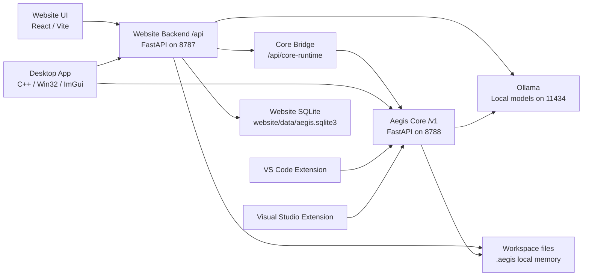

# Aegis ChatBot / Auralith OS System Architecture

Last updated: 2026-05-09

## Purpose

This repository contains the Aegis ChatBot / Auralith OS local-first AI ecosystem. It is not one chatbot process. It is a set of clients and runtimes that share workspace intelligence, local model status, memory, diagnostics, validation, tasks, and safe change workflows.

The current stabilization target is to keep the mature Website backend stable while making Aegis Core the small shared runtime that every client can rely on.

## Runtime Layers

## Layer Ownership

### Website Backend `/api`

The Website backend is the mature application runtime. It owns app-rich workflows that are still specific to Auralith OS and the Desktop client:

- Chat, streaming chat, routing preview, generated changes, apply, validate, verify, checkpoint restore.
- Project builder/scaffolding.
- Model registry, model manager, model benchmarks, provider routing, telemetry, feedback.
- Project intelligence, workspace intelligence, unified runtime/context, continuity, platform discipline.
- Distributed runtime, adaptive intelligence, productization, ecosystem, autonomous engineering.
- Creative Studio and media jobs.
- Website auth/session APIs.
- SQLite-backed application event/task/telemetry storage.
- Optional read-only Core bridge at `/api/core-runtime`, used to surface shared Core status without moving app workflows.

Default port: `http://127.0.0.1:8787`.

### Aegis Core `/v1`

Aegis Core is the shared local runtime contract. It must stay small, stable, local-first, and safe for Desktop, Website, VS Code, and Visual Studio to call:

- Core health and local model status.
- Shared settings stored in workspace-local `.aegis/config.json`.
- Workspace scan and roadmap generation.
- Shared memory summaries and diagnostics.
- Client registration and client listing.
- Shared tasks, task status, and dashboard aggregation.
- Validation summary/run.
- Plan-only continue and repair flows.
- Branding tokens shared by clients.

Default port: `http://127.0.0.1:8788`.

### Desktop Client

The Desktop app is a native shell and command center. It should own UI state, local preferences, windowing, streaming display, and user approval surfaces. It should not reimplement shared scan, dashboard, model health, or task semantics that exist in Core.

Current integrations:

- Uses Website `/api` for the mature app workflows.
- Uses Core `/v1/clients/register` and `/v1/ecosystem/dashboard`.
- Degrades when Core is offline by continuing to use Website `/api`.

### VS Code Extension

The VS Code extension owns IDE-specific UX, VS Code command registration, current editor/selection context, proposal preview, apply, rollback, and extension storage.

Current Core integrations:

- `/v1/health`
- `/v1/clients/register`
- `/v1/tasks`
- `/v1/tasks/{task_id}/status`

### Visual Studio Extension

The Visual Studio extension owns Visual Studio-specific UX, solution/project detection, selected-code context, Error List/build output integration, proposal approval, and rollback.

Current Core integrations:

- `/v1/health`
- `/v1/clients/register`

## Dependency Direction

The desired direction is:

- Clients may call Website `/api` for rich app workflows.
- Clients may call Core `/v1` for shared runtime state.
- Core must not depend on Website backend internals.
- Website may call Core through a thin bridge, but it must not require Core to be running for the mature web app to function.
- IDE extensions should prefer Core `/v1` for shared health, memory, tasks, diagnostics, roadmap, validation, and dashboard data as those integrations mature.

## Stabilization Rule

Do not move large workflows from Website `/api` into Core during stabilization. First make the boundary explicit, test it, and migrate one shared capability at a time only when all clients have a clear consumer contract.

## Runtime Consolidation Phase 1

Phase 1 adds a read-only Website-to-Core bridge instead of migrating workflows:

- `GET /api/core-runtime` reads Core `/v1/health`, `/v1/models`, `/v1/settings`, `/v1/memory`, `/v1/diagnostics`, and `/v1/ecosystem/dashboard`.
- `AEGIS_CORE_API_URL` controls the Core base URL for Website.
- Existing Website `/api` chat, apply, validation, routing, project-builder, auth, and product surfaces remain unchanged.
- Core stays independent of Website imports and Website-specific storage.

See `RUNTIME_CONSOLIDATION.md` for the subsystem ownership matrix and migration order.
