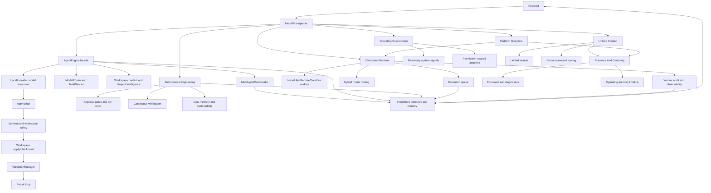

# Aegis Architecture

Aegis is a local-first coding-agent platform with a FastAPI backend, a React/Vite frontend, SQLite-backed event memory, deterministic project scaffolding, workspace checkpoints, validation recipes, and model routing across local and provider-backed adapters.

## Runtime Shape

- `website/backend/aegis_ai/main.py` exposes the FastAPI contract used by the web app and desktop client.
- `website/backend/aegis_ai/agent.py` is the compatibility facade for chat/develop/review/build turns. It still owns the public `AgentEngine` entry point while runtime contracts and helpers move into `aegis_ai/agent_runtime`.
- `website/backend/aegis_ai/multi_agent.py` records structured internal-agent outputs, handoffs, approvals, iteration limits, cancellations, and failure summaries for project work.
- `website/backend/aegis_ai/task_engine.py` defines the persistent task graph statuses, allowed state transitions, and default coding subtasks used by project work.
- `website/backend/aegis_ai/project_intelligence.py` builds persistent project profiles, architecture maps, file importance scores, memory notes, and smart context selections.
- `website/backend/aegis_ai/continuity.py` derives ambient presence, operating timeline, forecasts, cognitive workflow-awareness, self-diagnostics, workspace persistence, skill-pack metadata, universal data source readiness, platform SDK status, digital twin state, research lab evaluations, and memory distillation from Unified Context.
- `website/backend/aegis_ai/workspace_operations.py` builds the permission-aware workspace watcher, health engine, recommendations, scheduled intelligence job records, git intelligence, and long-term project memory summaries.
- `website/backend/aegis_ai/distributed_runtime.py` adds the local-first worker runtime, execution queue policy, worker capabilities, remote assignment gates, sync manifests, hybrid model routing, runtime observability, and worker audit events.
- `website/backend/aegis_ai/adaptive_intelligence.py` scores task outcomes, route quality, repair behavior, context efficiency, feedback, replay reports, benchmarks, and rollback-safe policy profiles.
- `website/backend/aegis_ai/productization.py` defines stable API contracts, the Plugin / Extension SDK manifest rules, enterprise policy profiles, recovery snapshots, reliability metrics, packaging/scaling readiness, and hardening recommendations.
- `website/backend/aegis_ai/ecosystem.py` manages reusable package manifests, signed workflows, shared intelligence profiles, organization policy, project knowledge graphs, cross-project insights, advanced search, reproducibility records, and governance trust signals.
- `website/backend/aegis_ai/autonomous_engineering.py` manages supervised long-running objectives, multi-phase plans, dry-run estimates, approval gates, autonomous iteration limits, parallel agent assignments, verification signals, refactor plans, goal memory, explainability records, and engineering analytics.
- `website/backend/aegis_ai/creative_media.py` manages Creative Studio media jobs, provider metadata, prompt presets, local image/motion/audio/voice draft generation, asset manifests, asset-library reads, and export packages.
- `website/backend/aegis_ai/unified_runtime.py` maps the whole multi-modal runtime into pillars, modalities, tool contracts, workflows, safety summaries, and active counts.
- `website/backend/aegis_ai/unified_context.py` converges tasks, timelines, Project Intelligence, memory, Creative Studio, Workspace Intelligence, Operating Environment, and distributed runtime records into one searchable context graph and global command router.
- `website/backend/aegis_ai/platform_discipline.py` codifies the convergence contract: chosen primary/secondary/experimental domains, roadmap status, stability tiers, feedback loops, design standards, behavior principles, performance budgets, security foundations, platform layers, and maintainability practices.
- `website/backend/aegis_ai/operating_environment.py` registers desktop, screen, overlay, automation, IDE, system intelligence, learning, research, story/simulation, environment, security, memory, personality, creative, distributed, and knowledge graph capabilities behind permission-scoped adapters and preview-first action checks.
- `website/backend/aegis_ai/workspace.py` owns allowed workspace roots, file discovery, file writes, checkpoints, restore, dependency profiling, and project manifests.
- `website/backend/aegis_ai/validation.py` owns validation command discovery, persisted recipes, command execution requests, and validation response shaping.
- `website/backend/aegis_ai/storage.py` owns SQLite persistence for tasks, events, repair attempts, fix memory, project memory, workspace operations snapshots, recommendations, watcher events, route telemetry, fallback telemetry, and model benchmarks.
- `website/backend/aegis_ai/project_scaffolder.py` owns project builder behavior. Template preset registry metadata is split under `aegis_ai/scaffolding`.
- `website/frontend/src/App.tsx` remains the app shell and state coordinator. Shared panels and utilities live under `website/frontend/src/components` and `website/frontend/src/utils`.

## Request Flow

## Compatibility Boundaries

The following contracts are treated as stable unless explicitly documented: FastAPI endpoint shapes, frontend TypeScript types in `website/frontend/src/types.ts`, desktop C++ client expectations, SQLite table shapes, `launch.ps1`, config files, Ollama/local model behavior, provider registry behavior, workspace checkpoint format, and scaffold output.

## Task Engine

Project work is persisted as a task graph in SQLite. A parent task tracks the user goal, project/workspace, status, priority, assigned role, related files, validation commands, checkpoints, error summary, and final summary. Default subtasks cover inspection, planning, editing, review, validation, repair, memory update, and summarization.

Task transitions are centralized in `task_engine.py`; callers move through explicit states such as `queued`, `planning`, `running`, `needs_approval`, `validating`, `repairing`, `completed`, `failed`, and `canceled`. `EventStore` records each state change as a timeline event, and FastAPI exposes list/read/cancel/approve/retry/timeline/artifact endpoints under `/api/tasks`.

## Multi-Agent Execution

Coding and validation work now runs through structured internal-agent events. The chain is Planner -> Architect -> Code -> Review -> Validation -> Repair -> Memory. These agents do not add new endpoint contracts; they write `agent.chain`, `agent.<role>`, `agent.handoff`, `agent.approval`, and `agent.control` events into the existing task timeline.

The coordinator enforces per-role iteration limits and records clear stop reasons when approval, cancellation, validation failure, or repair exhaustion blocks progress. Normal chat can still use the existing single-agent path and does not create a multi-agent chain.

## Project Intelligence

Each workspace can have a persistent Project Intelligence snapshot stored in SQLite. The snapshot contains a project profile, architecture map, file importance scores, indexing status, recommendations, recent failures, TODOs, and memory notes. The backend builds it from the workspace scan, dependency profile, project manifest, task history, fix memory, and project memory.

FastAPI exposes the snapshot and re-index controls under `/api/project-intelligence`. `AgentEngine` reads the saved snapshot before building context so coding tasks can start with known entry points, important files, API routes, conventions, validation commands, prior failures, and project memory instead of rediscovering the whole workspace on every turn.

## Autonomous Workspace Operations

Workspace Operations adds structured background intelligence without silent code modification. `WorkspaceOperationsEngine` compares watcher snapshots, detects file/dependency/git/validation drift, computes project health metrics, generates persistent recommendations, records scheduled intelligence job runs, and summarizes long-term project memory.

FastAPI exposes this layer under `/api/workspace-intelligence`. Scans persist watcher snapshots, recent events, health snapshots, recommendations, scheduled job state, and git summaries in SQLite. Recommendation `fix` creates a queued task tied to the related files and timeline event; it does not edit files directly. Scheduled jobs are recorded as explicit runs, and command-backed jobs such as validation snapshots stay skipped unless command execution is explicitly allowed by the caller.

## Distributed Runtime

Distributed Runtime scales Aegis beyond the single backend process without giving up the local-first baseline. `DistributedRuntimeManager` creates the default local worker, validates LAN/remote worker registrations, selects runnable queue jobs, checks worker capability and permission-scope compatibility, routes models across local/provider/remote candidates, creates deterministic sync manifests, and aggregates observability.

SQLite persists worker registrations, execution jobs, worker audit events, and workspace sync manifests. FastAPI exposes this under `/api/distributed-runtime`. Local workers can execute task, validation, build, indexing, telemetry, benchmark, and sync jobs synchronously. LAN and remote workers are only assigned when a dispatch request explicitly enables remote dispatch, and command-backed jobs still require explicit command permission plus the existing command allowlist and sandbox profile.

See `docs/DISTRIBUTED_RUNTIME.md` for endpoint details and security rules.

## Adaptive Intelligence

Adaptive Intelligence is the controlled learning layer over task, validation, model, context, and feedback telemetry. It persists task outcome records, route recommendations, replay reports, benchmark reports, policy profiles, and policy checkpoints in SQLite. Profile activation is explicit and checkpointed; it does not rewrite runtime code or silently alter the workspace.

See `docs/ADAPTIVE_INTELLIGENCE.md` for endpoint behavior, policy profile rules, replay behavior, benchmark scoring, and safety boundaries.

## Productization And Hardening

Productization is the production-readiness aggregate over the existing runtime. `ProductizationEngine` publishes versioned stable API contracts, validates permission-scoped plugin manifests, persists active enterprise policy profiles, checks SQLite recovery state, detects interrupted task and queue recovery work, aggregates reliability metrics, and records snapshot windows in SQLite.

FastAPI exposes this under `/api/productization`. The frontend `Hardening` surface shows recovery readiness, plugin SDK state, enterprise controls, stable APIs, reliability metrics, and packaging/scaling readiness. These controls are additive: they do not execute plugin code, do not modify project files, and do not change existing chat, task, checkpoint, validation, provider, or launch contracts.

See `docs/PRODUCTIZATION_AND_HARDENING.md` for plugin SDK rules, policy fields, recovery behavior, and reliability metric details.

## Ecosystem And Shared Intelligence

Ecosystem infrastructure turns the hardened runtime into a reusable platform. `EcosystemEngine` manages signed package manifests, reusable workflows, shared intelligence profiles, organization policy, knowledge graph snapshots, cross-project insights, advanced search, reproducibility records, and governance trust signals.

FastAPI exposes this under `/api/ecosystem`. Workflow runs create normal task graph records and timeline events. Package lifecycle changes, shared profile imports/exports, policy updates, and reproducibility records are audited in SQLite. The frontend `Ecosystem` surface shows the marketplace, workflow manager, organization dashboard, knowledge graph, search, cross-project intelligence, and reproducibility/audit state.

See `docs/ECOSYSTEM_AND_SHARED_INTELLIGENCE.md` for package, workflow, graph, search, and governance details.

## Controlled Autonomous Engineering

Controlled Autonomous Engineering turns a large user goal into a persistent objective program. `AutonomousEngineeringEngine` creates the objective, records seven phases, writes dry-run simulations, requires approval gates for risky work, assigns specialized internal-agent roles, links created tasks, records verification signals, stores refactor plans, updates goal memory, and emits explainability entries for routing, safety, validation, and plan changes.

FastAPI exposes this under `/api/autonomous-engineering`. The frontend `Autonomous` surface shows active objectives, pending approvals, phase status, simulations, verification, goal memory, and analytics. The engine is deliberately supervised: objective iteration is capped, dependency and destructive changes are disabled by default, rollback is required, and no file writes happen from the objective engine itself. File changes still go through tasks, approvals, checkpoints, validation, repair, and rollback.

See `docs/CONTROLLED_AUTONOMOUS_ENGINEERING.md` for objective state, endpoint behavior, safety limits, and data flow.

## Creative Studio

Creative Studio adds a local-first media workspace without changing the coding runtime. `CreativeMediaEngine` creates deterministic draft assets for image, video/storyboard, beat, and voice workflows; stores prompt packs, manifests, previews, and exports under `workspace/creative_media`; and exposes provider adapters for future paid/cloud generation behind explicit approval checks.

FastAPI exposes this under `/api/creative-studio` while keeping `/api/media` compatibility aliases. The frontend `Creative` surface shows prompt builders, provider selection, generation jobs, previews, asset library records, and export controls.

See `docs/CREATIVE_STUDIO.md` for job lifecycle, asset layout, provider safety, endpoints, and tests.

## Unified Runtime

The unified runtime is the product spine for Aegis as a multi-modal operating environment. `UnifiedRuntimeEngine` does not execute work by itself; it maps existing systems into capability pillars, modality support, tool contracts, workflow entries, memory status, safety rules, and recommendations. This keeps long-term platform growth visible without creating a disconnected subsystem for every idea.

FastAPI exposes this under `/api/unified-runtime`. The frontend Runtime surface renders this map before distributed worker and queue details.

See `docs/UNIFIED_RUNTIME.md` for the registry shape and product rules.

## Unified Context Engine

The Unified Context Engine is the convergence layer. It builds a normalized graph of records and relationships from tasks, task events, Project Intelligence, memory, fix memory, Creative Studio, Workspace Intelligence, Operating Environment, and distributed runtime jobs.

FastAPI exposes this under `/api/unified-context`, `/api/unified-context/search`, `/api/global-command/preview`, and `/api/global-command/submit`. The global command router decides whether a request remains chat or becomes a tracked task for coding, creative generation, research, automation, desktop/system work, or memory.

See `docs/UNIFIED_CONTEXT_ENGINE.md` for record shapes, routing rules, and search behavior.

## Presence And Continuity

Presence and Continuity sits above Unified Context. It turns the context graph into ambient AI presence, operating memory timeline, simulation/forecast signals, cognitive workflow-awareness, hardware routing notes, persistent workspace state, self-diagnostics, skill pack metadata, universal data layer readiness, platform SDK capability, a digital twin workspace model, controlled research lab evaluations, and memory distillation guidance.

FastAPI exposes this under `/api/continuity` and `/api/continuity/timeline/search`. It is read-first: it does not execute actions, prune memory, install skill packs, control the desktop, run commands, or mutate files.

See `docs/PRESENCE_AND_CONTINUITY.md` for safety rules and data flow.

## Platform Discipline

Platform Discipline is the governance layer for the convergence phase. It deliberately chooses three primary domains for mastery: AI Coding Workspace, AI Orchestration Runtime, and AI Memory And Knowledge OS. Automation, Creative Studio, and Research are secondary strengths. Desktop control and Security Workspace remain experimental until permission, consent, sandbox, adapter trust, audit, and UX quality are mature.

FastAPI exposes the read-only snapshot under `/api/platform-discipline`. The frontend renders it inside the existing Runtime surface so product focus, stewardship posture, the feature admission gate, stability tiers, performance budgets, behavior principles, and security foundations are visible without creating another dashboard. The stewardship posture makes preservation the default responsibility: protect quality, clarity, maintainability, trust, performance, and cohesion while reducing friction, clutter, latency, instability, architectural drift, and feature sprawl. The feature admission gate defaults to `reject_when_unclear`: if a proposal does not clearly strengthen identity, workflow quality, trust, performance, runtime fit, and maintainability, the answer is no. See `docs/PLATFORM_DISCIPLINE.md`.

## Operating Environment

The Operating Environment is the safe control plane for OS-level and non-coding expansion. `OperatingEnvironmentEngine` registers the capability families requested for a local-first AI operating environment while keeping executable desktop actions blocked until trusted adapters exist.

FastAPI exposes this under `/api/operating-environment` and `/api/operating-environment/actions/preview`. The first endpoint returns capability, adapter, permission, safety, and read-only host signal state. The preview endpoint explains whether an action is previewable, blocked, or approval-gated; it does not launch apps, capture screens, press keys, move the mouse, change settings, inspect processes, or install dependencies.

See `docs/OPERATING_ENVIRONMENT.md` for capability families, adapter rules, and safety defaults.

## Test Boundaries

Backend regression coverage lives in `website/backend/tests`. Golden workflow coverage is in `test_golden_workflows.py`; representative scaffold template snapshots are in `test_project_scaffolder_snapshots.py`. Frontend contract and utility tests live beside the utilities in `website/frontend/src`.
