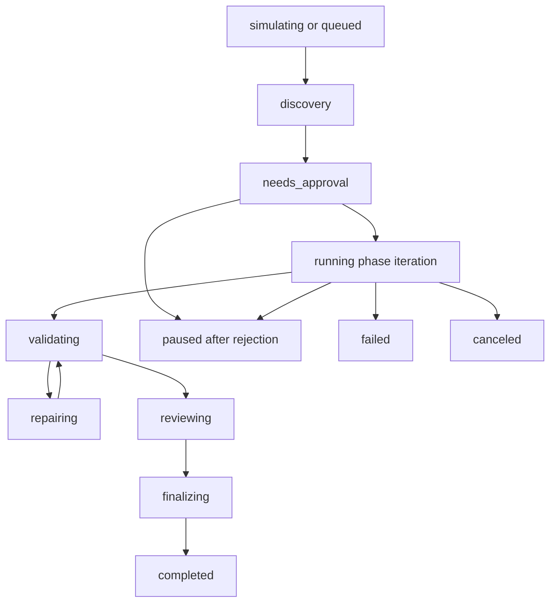

# Controlled Autonomous Engineering

Controlled Autonomous Engineering lets Aegis track long-running engineering objectives as supervised, persistent programs. It is an orchestration layer over tasks, agents, validation, checkpoints, memory, and safety controls. It is not an uncontrolled autonomous writer.

## Core Module

`website/backend/aegis_ai/autonomous_engineering.py` owns the objective runtime. It creates and advances objective records, builds dry-run estimates, records approval gates, links task graph work, assigns specialized internal-agent roles, records verification signals, stores refactor plans, updates goal memory, and writes explainability entries.

SQLite persistence lives in `EventStore` tables for:

- `autonomous_objectives`
- `autonomous_phases`
- `autonomous_approval_gates`
- `autonomous_agents`
- `autonomous_verification`
- `autonomous_simulations`
- `autonomous_refactor_plans`
- `autonomous_explanations`

## Objective Shape

An objective stores the long-running goal and the state needed to survive restarts:

- objective id, workspace root, title, user goal, priority, status, timestamps
- current phase and iteration/repair counts
- assigned agent roles and linked task ids
- phase ids, approval gate ids, simulation ids
- safety limits and protected file zones
- goal memory, final summary, and error summary

Default phases are discovery, planning, implementation, validation, review, optimization, and finalization.

## State Flow

Approval gates pause risky work before implementation. Approved gates allow the next iteration to continue. Rejected gates pause the objective and record the reason.

## Safety Limits

Objectives enforce runtime limits before work advances:

- maximum iterations
- maximum parallel agents
- token budget
- maximum projected file changes
- maximum dependency changes
- maximum repair attempts
- approval checkpoint interval
- protected file zones
- rollback requirement
- dependency-change and destructive-action switches

The objective engine does not directly apply file edits. File-changing work must create or link task graph work and continue through the existing approval, `FileChange`, checkpoint, validation, repair, and rollback path.

## Dry Run And Simulation

Creating an objective defaults to `dry_run=true`. The engine records projected impact, validation risk, expected files, expected dependency changes, token cost, iteration estimate, warnings, and required approval gates. Users can rerun simulation without advancing phases.

## Agents And Verification

Objectives assign specialized roles for planner, architect, code, review, validation, repair, documentation, and performance analysis. Agent assignments are state records and timeline signals; they do not execute unbounded loops. Iteration remains capped by the objective safety limits.

Continuous verification records validation, review, security, policy, architecture, and performance signals. Failed validation can move the objective into repair, but repair attempts are bounded and summarized when exhausted.

## Goal Memory And Explainability

Goal memory persists objective history, completed phases, failed approaches, successful patterns, remaining work, and user preferences. Explainability entries record why dry run was selected, why approval was required, why a route or phase changed, and why validation or repair was attempted.

## API Endpoints

- `GET /api/autonomous-engineering`
- `GET /api/autonomous-engineering/objectives`
- `POST /api/autonomous-engineering/objectives`
- `GET /api/autonomous-engineering/objectives/{objective_id}`
- `POST /api/autonomous-engineering/objectives/{objective_id}/simulate`
- `POST /api/autonomous-engineering/objectives/{objective_id}/start`
- `POST /api/autonomous-engineering/objectives/{objective_id}/pause`
- `POST /api/autonomous-engineering/objectives/{objective_id}/cancel`
- `POST /api/autonomous-engineering/objectives/{objective_id}/iterate`
- `GET /api/autonomous-engineering/approval-gates`
- `POST /api/autonomous-engineering/approval-gates/{gate_id}/approve`
- `POST /api/autonomous-engineering/approval-gates/{gate_id}/reject`

## Frontend

The `Autonomous` sidebar surface in `website/frontend/src/App.tsx` renders objective creation, objective lists, phase progress, approval gates, simulations, verification, explainability, goal memory, and analytics. The TypeScript contracts are in `website/frontend/src/types.ts`, and client functions are in `website/frontend/src/api.ts`.

## Tests

Backend coverage lives in `website/backend/tests/test_autonomous_engineering.py`. Frontend API contract coverage lives in `website/frontend/src/api.test.ts`. The tests cover objective persistence, state transitions, approval flow, verification recording, rejection pause behavior, API lifecycle calls, and frontend endpoint contracts.
