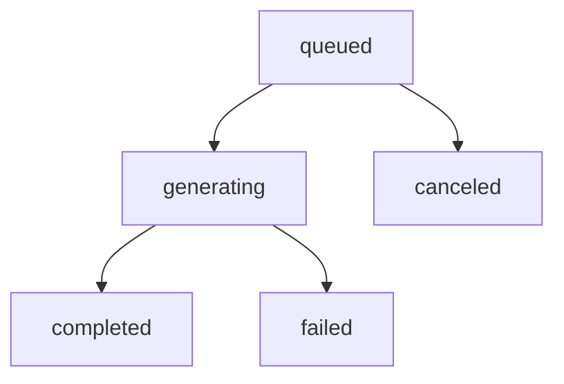

# Aegis Creative Studio

Aegis Creative Studio is the local-first media workspace for generating, revising, organizing, and exporting creative assets. It builds on the existing `creative_media.py` local renderer instead of adding an uncontrolled external-generation layer.

## Scope

Creative Studio supports four practical studios:

- Image Studio: images, logos, UI mockups, icons, product mockups, style-transfer prompt packs, background-removal previews, upscales, and variations.
- Video Studio: storyboards, short promo/app-showcase structures, animated logo intro packages, social clips, GIF previews, HTML motion previews, and edit decision lists.
- Beat Studio: beat arrangements, drum/melody sketches, WAV previews, MIDI sketches, stems manifests, BPM/key/genre settings, and loopable arrangement notes.
- Voice Studio: voiceover and narration scripts, scratch WAV previews, sound-effect/audio-cleanup profiles, and provider-ready voice prompts.

The local renderer creates deterministic draft assets, editable source files, prompt packs, manifests, and export packages. Cloud image/video/music/TTS providers are represented as provider adapters and require explicit approval before use.

## Job Lifecycle

Media generation runs as tracked jobs:

Synchronous local jobs move through queued/generating/completed in one request and persist their timeline in `manifest.json`. Jobs record provider id/name, prompt, effective prompt, settings, seed, output path, cost estimate, elapsed time, warnings, errors, and generated assets.

## Asset Library

Generated media lives under:

`workspace/creative_media/<job_id>/`

Each job stores:

- `manifest.json`
- `prompt_pack.json`
- `creative_brief.md`
- editable SVG and layer manifests
- PNG/GIF previews when Pillow is available
- WAV/MIDI/audio manifests for beat and voice jobs
- export records under `exports/`

The asset library endpoint aggregates jobs and assets across the local media folder.

## Provider Safety

Creative Studio requires explicit approval for:

- paid provider generation
- large GPU or long video jobs
- copyright-sensitive style prompts
- voice cloning

Local draft generation is free and enabled by default. Provider adapters are metadata seams until an actual provider implementation is installed and approved.

## API

- `GET /api/creative-studio`
- `GET /api/creative-studio/providers`
- `GET /api/creative-studio/prompt-presets`
- `GET /api/creative-studio/jobs`
- `POST /api/creative-studio/jobs`
- `GET /api/creative-studio/jobs/{job_id}`
- `POST /api/creative-studio/jobs/{job_id}/cancel`
- `GET /api/creative-studio/assets`
- `GET /api/creative-studio/assets/file`
- `POST /api/creative-studio/jobs/{job_id}/export`

The older `/api/media/...` routes remain as compatibility aliases.

## Frontend

The `Creative` sidebar section shows prompt builders, provider selection, job status, preview playback, asset library records, and export actions. It keeps media generation separate from coding tasks so daily engineering workflows stay calm and understandable.

## Tests

Backend coverage lives in `website/backend/tests/test_creative_studio.py`. Frontend API coverage lives in `website/frontend/src/api.test.ts`.
