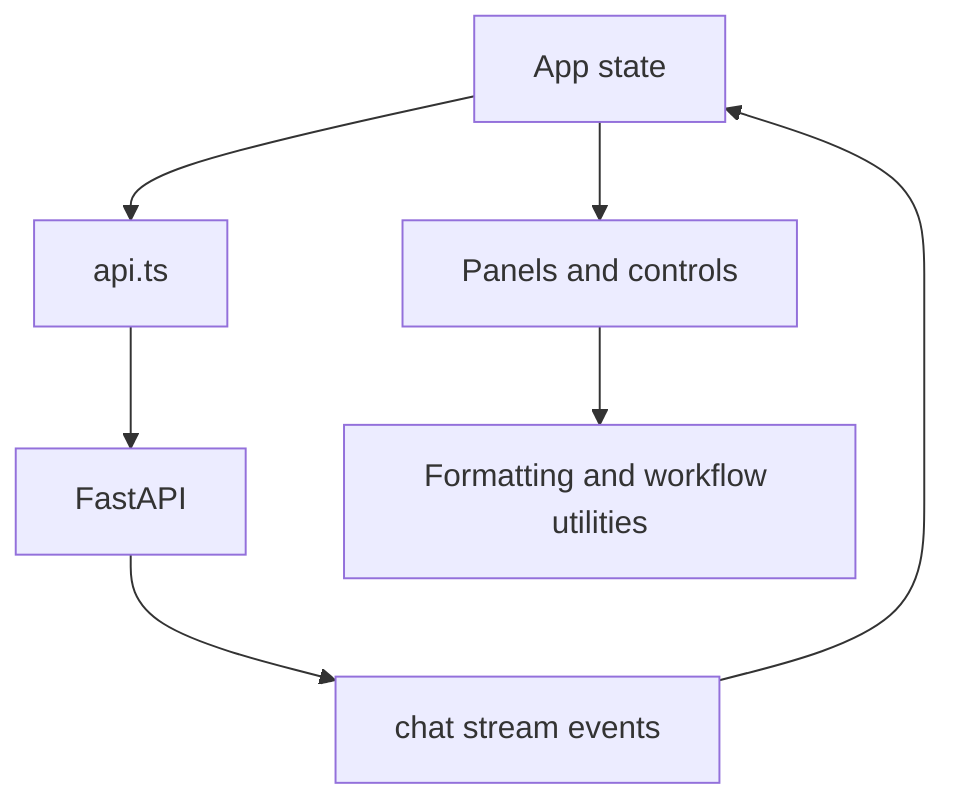

# Frontend Structure

The frontend is a React/Vite application. `App.tsx` still coordinates top-level state, but shared behavior is moving into focused components and utilities without changing UI behavior.

## Current Modules

- `src/App.tsx`: application shell, routing between chat/projects/project intelligence/workspace intelligence/runtime/adaptive/hardening/ecosystem/autonomous/creative/tasks/agents/models surfaces, settings modal state, streaming orchestration, workspace state, and generated-change review state.
- `src/components/ObservabilityPanel.tsx`: telemetry, route quality, fallback, feedback, and policy inspection.
- `src/components/MemoryEditor.tsx`: project memory create/edit surface.
- `src/components/ApprovalSettings.tsx`: approval tier and sandbox controls.
- `src/components/ModelSelector.tsx`: shared model dropdown used by the model surface and model settings.
- `src/components/TaskStatusSummary.tsx`: reusable task status metrics used by the Tasks workspace surface.
- `src/utils/appUi.tsx`: UI formatting, model option helpers, status mapping, runtime diagnostic icons, and chat response summaries.
- `src/utils/appStorage.ts`: browser persistence for detail panels, selected files, queued message pause state, custom agents, and automatic memory fingerprints.
- `src/utils/generatedChanges.ts`: generated change IDs, apply intent, warning merge, diff summary, and apply status.
- `src/utils/validationStatus.ts`: validation status labels, clipboard text, and repair prompt text.
- `src/utils/conversations.ts`: saved conversation storage and export helpers.
- `src/utils/missionAnchor.ts`: mission continuity messages.
- `src/api.ts`: stable frontend API client contract.
- `src/types.ts`: TypeScript mirror of backend response/request shapes.

## Data Flow

## Refactor Rules

- Move view sections into components by behavior boundary: chat workspace, project panel, model selector, observability, file/diff viewer, validation panel, memory center, settings/approval controls, command palette, and project builder.
- Keep state ownership predictable. If a component only renders, pass data and callbacks. If a component owns async behavior, document the API call and state it owns.
- Do not change TypeScript contracts without updating `src/types.ts`, backend schemas, and endpoint tests.
- Do not redesign layout or remove workflows during modularization.

## Tasks Surface

The Tasks surface is selected from the sidebar and reads from `/api/tasks`. Selecting a task loads `/api/tasks/{task_id}/timeline` and `/api/tasks/{task_id}/artifacts`; cancel, approve, and retry buttons call the matching action endpoints and then refresh the selected task. Multi-agent execution appears in the same timeline through agent-titled events such as Planner Agent, Code Agent, Review Agent, Validation Agent, Repair Agent, and Memory Agent.

## Project Intelligence Surface

The Intelligence surface is selected from the sidebar and reads from `/api/project-intelligence`. It shows the persisted stack summary, architecture map, important files, validation commands, recent failures, TODOs, and project memory notes. Scan, rebuild memory, and clear/rebuild controls call `/api/project-intelligence/reindex` and then refresh the displayed snapshot.

## Workspace Intelligence Surface

The Workspace surface is selected from the sidebar and reads from `/api/workspace-intelligence`. It shows project health, active recommendations, watcher events, validation drift, git changes, risky diffs, scheduled intelligence job runs, task statistics, focused architecture/validation/dependency signals, and long-term memory summaries.

Scan controls call `/api/workspace-intelligence/scan`. Scheduled job controls call `/api/workspace-intelligence/jobs/run` with command execution disabled by default. Recommendation `Fix now` calls `/api/workspace-intelligence/recommendations/{id}/fix`, which creates a tracked task instead of directly editing files; dismiss calls `/api/workspace-intelligence/recommendations/{id}/dismiss`.

## Distributed Runtime Contracts

`src/types.ts` mirrors unified runtime, worker, queue, audit, routing, sync, and observability shapes from the backend. `src/api.ts` exposes the runtime client functions for the Runtime surface:

- unified runtime capability map
- modality support
- tool contracts
- workflow entries
- safety guidance
- operating-environment capability map
- OS adapter trust state
- read-only system signals
- unified context source summaries
- cross-module insights
- global command routing preview
- presence and continuity signals
- operating memory timeline counts
- forecasts, self-diagnostics, hardware routing, digital twin, skill pack, and data source summaries
- platform discipline stewardship posture, domain choices, stability tiers, performance budgets, design standards, and behavior principles

- runtime snapshot and observability
- worker list/register/heartbeat/revoke
- execution queue list/create/read/cancel/retry/dispatch
- hybrid model route preview
- worker audit log
- sync manifest list/export

The frontend contract intentionally keeps runtime APIs separate from chat state. The Runtime surface is the capability spine: it shows what Aegis can do, then worker/queue state. Command or remote execution controls must continue to surface explicit user intent before calling dispatch with `allow_commands` or `allow_remote`.

The AI Operating Environment section lives inside Runtime. It reads `/api/operating-environment`, shows desktop/screen/system/research/learning/security/creative/distributed capability readiness, lists enabled and blocked adapters, and displays read-only system signals. It does not show executable desktop action buttons while those adapters are blocked.

The Unified Context section also lives inside Runtime. It reads `/api/unified-context` and previews requests through `/api/global-command/preview`. This is the convergence layer: it shows how tasks, media, project intelligence, workspace events, memory, operating capabilities, and runtime jobs relate before execution moves to the owning subsystem.

The Presence and Continuity section reads `/api/continuity`. It shows ambient presence, quiet suggestions, forecast signals, workspace persistence, self-diagnostics, hardware routing notes, digital twin confidence, skill pack count, and universal data source count. It intentionally stays compact and read-only.

The Platform Discipline section reads `/api/platform-discipline`. It makes the convergence contract visible: stewardship posture, primary/secondary/experimental domains, stable versus experimental counts, the feature admission gate, stability tiers, performance budgets, behavior principles, and design-standard enforcement. This section belongs in Runtime because it governs the whole platform rather than adding another dashboard.

The stewardship and feature admission UI should stay compact: show what must be preserved/reduced, the default decision, hard no rules, and representative questions. It is a restraint surface, not another workflow builder.

## Hardening Surface

The Hardening surface reads `/api/productization`. It renders runtime recovery, enterprise policy, plugin SDK validation, stable API contracts, reliability metrics, and packaging/scaling/documentation readiness. The surface can validate a sample read-only plugin manifest and manage registered plugin enabled/trusted flags through productization endpoints.

The UI does not execute plugin code and does not bypass workspace safety. File-changing plugin capabilities still have to go through approval, checkpoints, validation, and rollback.

## Ecosystem Surface

The Ecosystem surface reads `/api/ecosystem`. It renders the marketplace catalog, installed package lifecycle state, reusable workflow manager, organization policy summary, governance trust signals, knowledge graph metrics, architecture-aware search results, shared intelligence profiles, cross-project insights, reproducibility records, and ecosystem audit events.

Workflow `Run` creates a tracked task graph through `/api/ecosystem/workflows/{workflow_id}/run`. Package trust/enable/disable buttons call the ecosystem package lifecycle endpoints. Export current creates a shared intelligence profile from the active project intelligence snapshot.

## Autonomous Surface

The Autonomous surface reads `/api/autonomous-engineering`. It renders supervised long-running objectives, active objective counts, pending approval gates, dry-run simulation risk, phase progress, continuous verification signals, explainability notes, goal memory, and engineering analytics.

Creating an objective uses `/api/autonomous-engineering/objectives` with `dry_run=true` by default. Objective actions call start, iterate, simulate, pause, and cancel endpoints. Approval buttons call `/api/autonomous-engineering/approval-gates/{gate_id}/approve` or `/reject`. The UI does not apply workspace edits from this surface; it exposes supervision, state transitions, and review of planned work while edits remain routed through tasks, checkpoints, validation, and repair.

## Creative Surface

The Creative surface reads `/api/creative-studio`. It renders Image, Video, Beat, Voice, and Library tabs with structured prompt inputs, provider selection, tracked media jobs, asset previews, local asset-library records, and export buttons.

Generation calls `/api/creative-studio/jobs`. Library and preview reads call `/api/creative-studio/assets` and `/api/creative-studio/assets/file`. Export buttons call `/api/creative-studio/jobs/{job_id}/export`. Paid, GPU-heavy, copyright-sensitive, and voice-cloning jobs remain blocked unless the request includes the matching approval flags.
