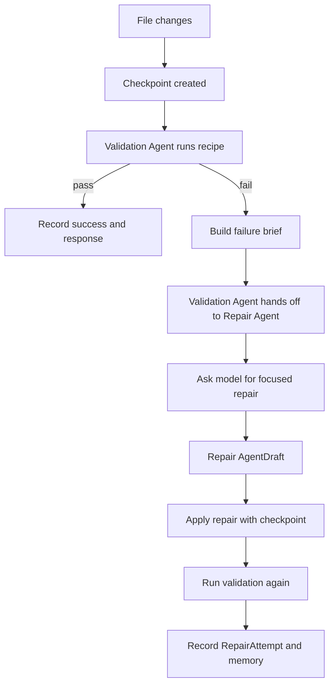

# Validation And Repair

Aegis treats validation as part of the coding workflow, not a detached command runner. Validation recipes can be discovered, saved, overridden for a turn, executed after changes, and used to drive repair attempts.

## Modules

- `aegis_ai.validation.ValidationManager`: validation profile discovery, saved recipe IO, command execution, output parsing, and response shaping.
- `aegis_ai.commands.CommandRunner`: guarded command execution with command metadata.
- `aegis_ai.workspace.WorkspaceManager`: applies repair changes with checkpoints.
- `aegis_ai.storage.EventStore`: persists `RepairAttempt` rows and fix/project memory.
- `aegis_ai.multi_agent.MultiAgentCoordinator`: records Validation Agent and Repair Agent handoffs, outcomes, approval pauses, and max-iteration stops.
- `aegis_ai.agent.AgentEngine`: coordinates validation requests, failed validation summaries, repair prompts, and repair result reporting.
- `aegis_ai.workspace_operations.WorkspaceOperationsEngine`: records validation drift and scheduled validation snapshot runs as workspace intelligence signals.
- `aegis_ai.autonomous_engineering.AutonomousEngineeringEngine`: records objective-level verification signals, bounded repair intent, and failure summaries for long-running objectives.

## Flow

## Repair Rules

- Repair should target validation failure evidence, not unrelated product changes.
- Repair attempts use normal file-change safety and checkpoint behavior.
- A failed repair is still recorded with before/after signatures and outcome.
- Successful repairs can feed fix memory so repeated failures are easier to resolve later.
- Validation output excerpts are bounded before being included in prompts or responses.
- Repair loops obey the turn's repair-attempt limit and the Repair Agent's max iteration budget.
- Scheduled workspace validation snapshots are observation jobs. They are skipped unless command execution is explicitly allowed for that job run.
- Autonomous objective validation is recorded as verification signals and phase state. Failed validation can move an objective into repair, but repair remains capped and must still use the normal task, file-change, checkpoint, and validation path.

## Regression Coverage

Existing parser and workspace tests cover repair-oriented parsing, adherence checks, checkpoints, rollback, and validation command behavior. `test_golden_workflows.py` adds a workflow-level persistence check for validation repair attempts and project memory. `test_autonomous_engineering.py` verifies objective iteration records validation signals and stops safely around approval and rejection states.
