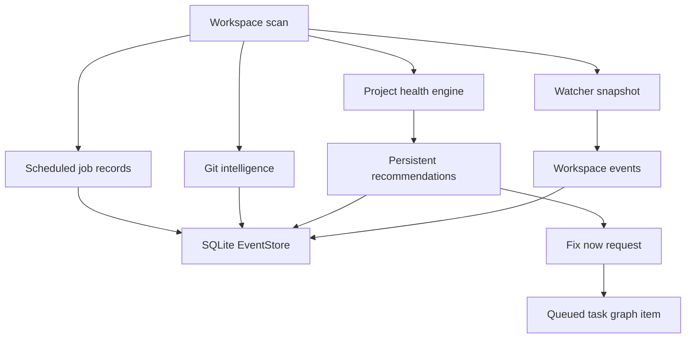

# Workspace Operations

Autonomous Workspace Operations gives Aegis a persistent, permission-aware view of project health over time. It is designed for observation, recommendations, and task creation, not silent code mutation.

## Backend Modules

- `aegis_ai.workspace_operations.WorkspaceOperationsEngine`: builds watcher snapshots, health metrics, recommendations, scheduled job records, git intelligence, and long-term memory summaries.
- `aegis_ai.storage.EventStore`: persists workspace watcher snapshots, operations snapshots, events, recommendations, and scheduled intelligence job runs.
- `aegis_ai.main`: exposes `/api/workspace-intelligence` scan/read/action endpoints and connects recommendations to the task graph.
- `aegis_ai.workspace.WorkspaceManager`: supplies safe workspace scans, dependency profiles, checkpoint creation, and rollback.

## Data Flow

## Watcher Signals

The watcher compares the current file state with the previous persisted snapshot. It records file creation, deletion, modification, dependency manifest changes, git branch changes, dirty git state, deleted git files, and validation drift notes.

Watcher events are stored separately from the latest snapshot so the UI can show a recent timeline without rereading the whole workspace.

## Health Engine

Health metrics cover failing tests, dependency freshness, large risky files, dead code candidates, TODO/FIXME hotspots, validation instability, duplicate code, architecture drift, and build performance. Each metric has a status, score, summary, evidence, and related files. The aggregate health score is a bounded 0 to 100 value.

## Recommendations

Recommendations are generated from warning/critical health metrics, recurring validation failures, dependency warnings, watcher events, and broad architecture signals. They include severity, category, rationale, related files, related tasks, evidence, status, and a fix prompt.

Dismissed recommendations remain persisted and are filtered from active scans. Fix requests create queued tasks and a timeline event; they do not directly edit workspace files.

## Scheduled Intelligence Jobs

Default jobs include nightly indexing, dependency refresh, validation snapshot, architecture refresh, token usage analysis, project compression, benchmark refresh, and telemetry snapshot. The first implementation records explicit job runs through the API. Command-backed jobs stay skipped unless a caller sets `allow_commands` for that run.

## Git Intelligence

Git summaries include repository detection, branch/upstream, local branches, changed/staged/untracked/deleted files, risky diffs, change heatmaps, recent commits, and task-to-commit link hints from commit text.

## Safety Rules

- Workspace Operations may persist observations, snapshots, and recommendations.
- Workspace Operations may create tasks from recommendations.
- Workspace Operations must not write project files directly.
- File changes still require the normal task, approval, checkpoint, validation, repair, and rollback flow.
- Scheduled validation commands require explicit command permission.

## Regression Coverage

`website/backend/tests/test_workspace_operations.py` covers watcher event handling, recommendation generation and persistence, git event processing, scheduled job records, permission-gated recommendation fixes, command-gated validation snapshots, checkpoint association, and rollback safety.
